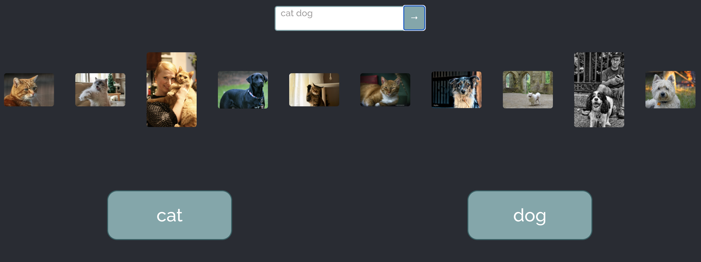
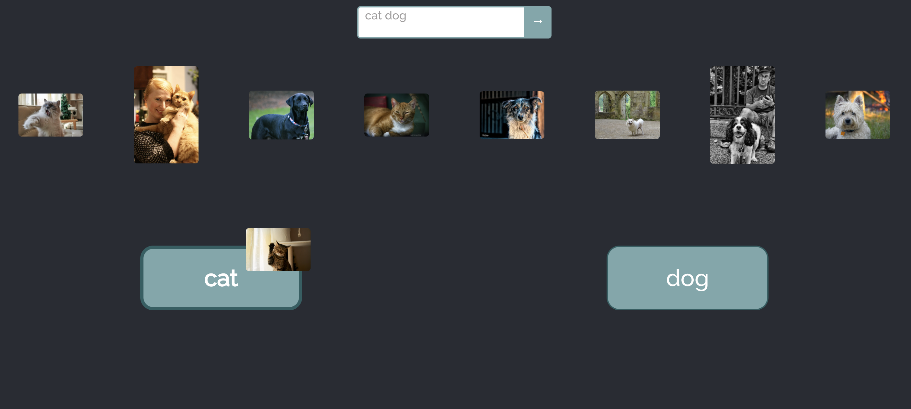
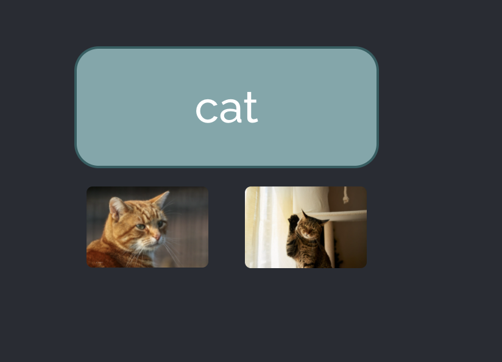

# Picture Sorting Drag and Drop

Hi there! This is my project created using Flickr API. In this game you can get some photos from Flickr by tags and sort them into appropriate categories.

## Getting started

It is quite easy, please run:

### `npm install`

to install all the necessary modules and then run

### `npm start`

or

### `npm run build`

if you prefer :)

## Using my app

When the app is launched, please type any two words into the search bar

Then press the search button and you will receive 10 shuffled photos (5 photos per keyword)

You can now start sorting. Just drag image into appropriate basket

At any moment you can see the images which have already been put in the basket. Just press the basket button

## Some facts about the app

* Drag and Drop interface was created using `react-beautiful-dnd`
* I used `flickr-sdk` Flickr API client to fetch images from Flickr
* If the app doesn't search images that is beacuse my api key has expired:( However, you can always insert your own at `DownloadImages` function in `Store.js`
* I learned to create README files thanks to this app :)

